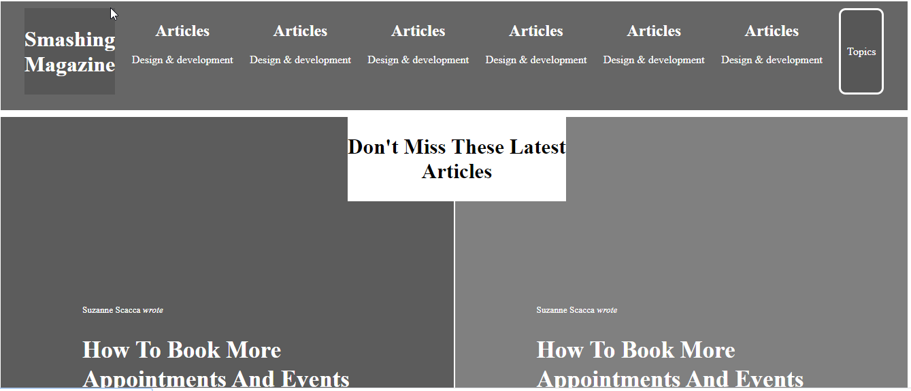

# Smashing-Magazine

> Smashing Magazine Heatmap

Heatmap of the [Smashing Magazine](https://www.smashingmagazine.com/) website.

## Built With

- Html,
- CSS

## Live Demo

[Live Demo Link]()

## Authors

👤 **Author1**

- Github: [@nellencr](https://github.com/nellencr)
- Linkedin: [Nela Komane](https://www.linkedin.com/in/nela-komane-8866b9192/)

👤 **Author2**

- Github: 
- Linkedin: 
## 🤝 Contributing

Contributions, issues and feature requests are welcome! Start by:
* Forking the project
* Cloning the project to your local machine
* `cd` into the project directory
* Run `git checkout -b your-branch-name`
* Make your contributions
* Push your branch up to your forked repository
* Open a Pull Request with a detailed description to the development branch of the original project for a review

